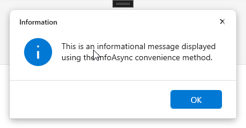
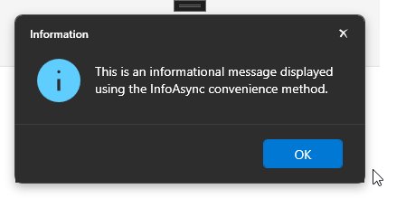

# FluentDialogs.Wpf

Modern, injectable WPF dialog library with Windows 11 Fluent Design. Replaces `System.Windows.MessageBox` with async, MVVM-compatible, fully themeable dialogs.

[](https://www.nuget.org/packages/FluentDialogs.Wpf)
[](LICENSE)

## Features

- **Async-first** — All dialogs are async, no UI blocking
- **Dependency Injection** — First-class DI support with `IMessageBoxService`
- **MVVM-friendly** — Injectable, testable, mockable services
- **Fluent Design** — Windows 11 styling with light/dark themes
- **Token-based Theming** — Three-layer design token system (Primitives → Semantics → Brushes) with runtime switching, accent colors, and custom presets
- **Comprehensive** — Info, confirm, error, input, selection, progress, toast notifications
- **Fluent Builder** — Chainable API with result callbacks
- **Extensible** — Custom buttons, content, and theming
- **Backward Compatible** — v1 resource keys still work via built-in compatibility layer

## Quick Start

### Install

```bash
dotnet add package FluentDialogs.Wpf
```

### Setup

```csharp
// Register services with optional configuration
services.AddFluentDialogs(options =>
{
    options.DefaultPreset = MessageBoxTheme.Light; // or .Dark
    // options.AccentColor = Colors.Purple;        // optional brand color
});
```

```xml
<!-- App.xaml — Single entry point for all theme resources -->
<ResourceDictionary.MergedDictionaries>
    <ResourceDictionary Source="pack://application:,,,/FluentDialogs.Wpf;component/Themes/FluentDialogs.Theme.xaml"/>
</ResourceDictionary.MergedDictionaries>
```

### Use

```csharp
public class MainViewModel
{
    private readonly IMessageBoxService _messageBox;
    private readonly IToastService _toast;

    public MainViewModel(IMessageBoxService messageBox, IToastService toast)
    {
        _messageBox = messageBox;
        _toast = toast;
    }

    public async Task DeleteAsync()
    {
        var result = await _messageBox.ConfirmAsync("Delete this item?", "Confirm");
        if (result == MessageBoxResult.Yes)
        {
            // Delete item
            _toast.ShowSuccess("Item deleted!");
        }
    }
}
```

### Theme Switching

```csharp
public class SettingsViewModel
{
    private readonly IFluentDialogThemeService _theme;

    public SettingsViewModel(IFluentDialogThemeService theme)
    {
        _theme = theme;
    }

    public void ToggleDarkMode(bool isDark)
    {
        _theme.ApplyPreset(isDark ? MessageBoxTheme.Dark : MessageBoxTheme.Light);
    }
}
```

### Fluent Builder

```csharp
await _messageBox.Confirm("Delete item?")
    .OnYes(() => DeleteItem())
    .OnNo(() => Cancel())
    .ShowAsync();
```

## Services

| Service | Description |
|---------|-------------|
| `IMessageBoxService` | Modal dialogs (info, confirm, error, input, selection, progress) |
| `IToastService` | Non-blocking toast notifications |
| `IFluentDialogThemeService` | v2 theme management — presets, tokens, accent color |
| `IMessageBoxThemeService` | Legacy v1 theme service (still works via adapter) |

## Theming Architecture

FluentDialogs uses a **three-layer design token** system:

```
Primitives (_Primitives.xaml)   — Raw color palette (never referenced by controls)
    ↓
Semantics  (_Semantics.xaml)    — Meaning-based aliases (THE customization layer)
    ↓
Brushes    (_Brushes.xaml)      — SolidColorBrush resources consumed by control styles
```

Override semantic tokens to customize every dialog without touching control templates. See the [Theming Guide](docs/theming.md) for full details.

## Avoiding Namespace Conflicts

Use Fluent-prefixed aliases to avoid conflicts with `System.Windows`:

```csharp
using FluentDialogs.Models;

var options = new FluentMessageBoxOptions { /* ... */ };
FluentDialogResult result = await _messageBox.ShowExtendedAsync(options);
```

## Documentation

- [Getting Started](docs/getting-started.md)
- [API Reference](docs/api-reference.md)
- [Dialogs Guide](docs/dialogs.md)
- [Progress Dialogs](docs/progress.md)
- [Toast Notifications](docs/toasts.md)
- [Theming Guide](docs/theming.md)
- [Fluent Builder](docs/builder.md)

## Screenshots

### Light Theme


### Dark Theme


## Requirements

- .NET 9.0+
- Windows Desktop Runtime

## License

MIT
